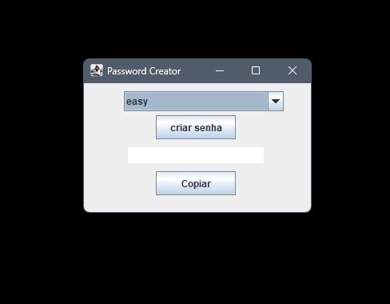

# 🔐 Java Password Generator

A simple Java application that generates passwords in three difficulty levels: **easy**, **medium**, and **hard**.

This project was built using **Java Swing** for the user interface and includes automatic copying of generated passwords to the clipboard.

---

## 🚀 Features

- 🔠 Generates random passwords based on difficulty:
  - **Easy**: Word-based passwords with some numbers (easier to remember)
  - **Medium**: number + Capitalized word + numbers + random characters
  - **Hard**: High-entropy 16-character string with letters, numbers and symbols
- 📋 Automatically copies the generated password to the clipboard
- 🖱️ Simple and intuitive Swing interface
- 💻 No external dependencies

---

## 🖼️ Preview



---

## 🛠️ How to Run

### ✅ Requirements:
- Java 8 or higher
- IDE like IntelliJ or Eclipse (optional)

### 💡 Run from terminal:
```bash
mvn clean install
mvn exec:java 
